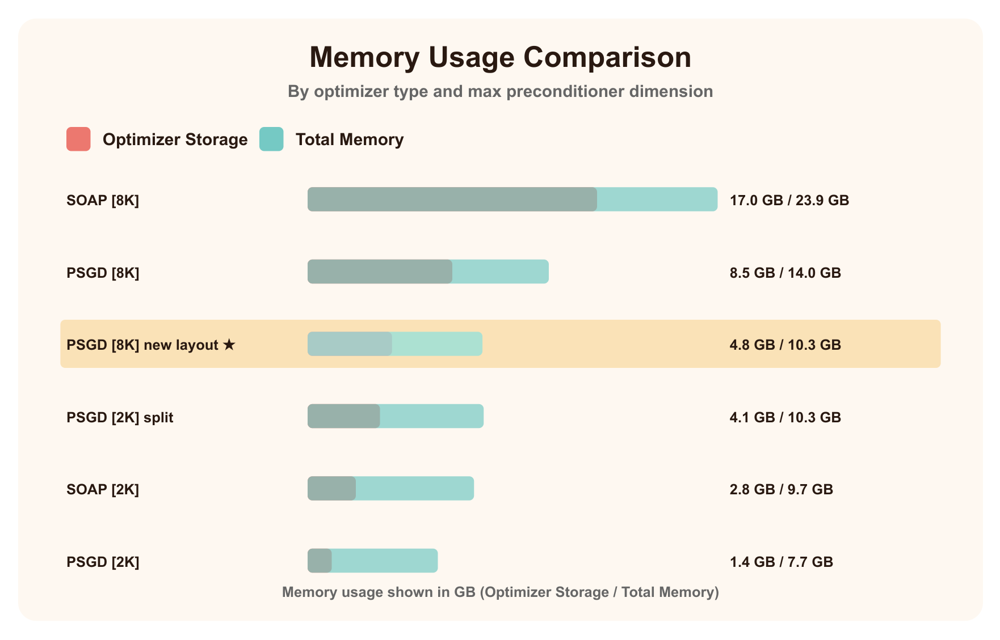
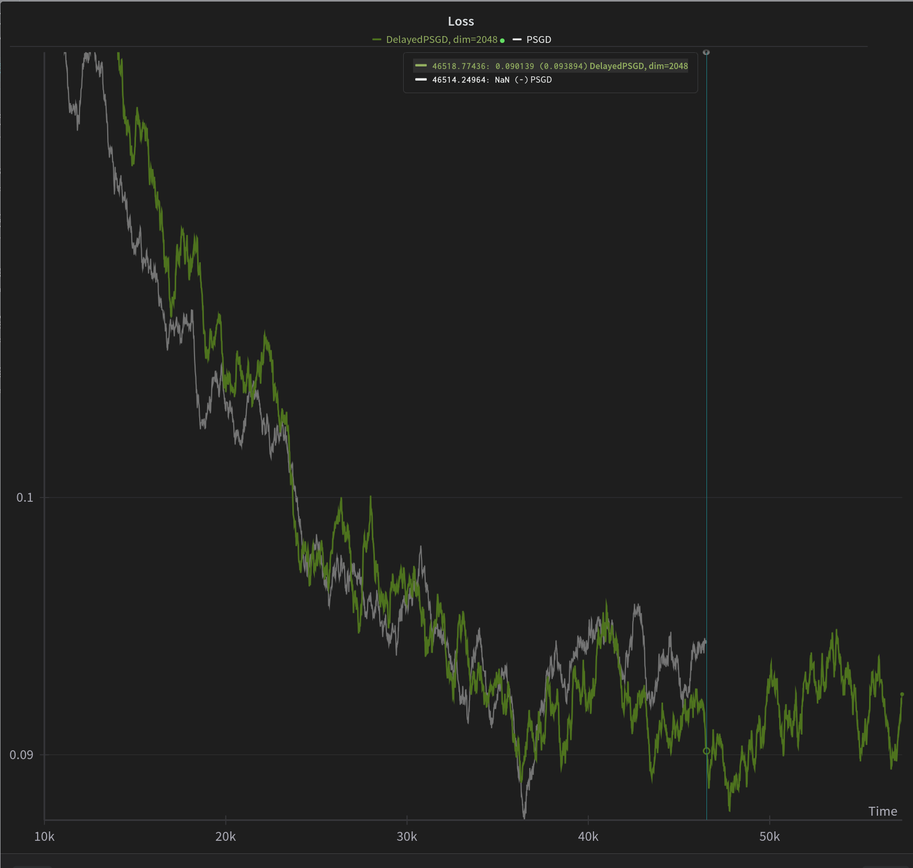

# HeavyBall

> [!IMPORTANT]  
> It's recommended to use `heavyball.utils.set_torch()` for faster training and less memory usage.

A simple package of efficient optimizers

The goal is not to thrive for completeness, full maintenance or abstraction, but instead to provide a simple
largely static alternative to `torch.optim` with more and better optimizers.

Currently (2024-11-20, 0.17.0), the recommended stable optimizer is `PrecondSchedulePaLMSOAP` (see below). The
recommended experimental optimizer is `DelayedPSGDKron` ([tuning guide](docs/psgd_efficiency.md)).

## Features

* **Stochastic Rounding**: [FP32 convergence with BF16 parameters](https://github.com/pytorch/pytorch/issues/120376)
* **Inplace EMA**: Same math, but less memory, less compute and higher stability
* **Foreach**: Fast multi-tensor application (turn it off to save memory via `foreach=False`)
* **PaLM Beta2**: Fast initial
  convergence, [stable late convergence](https://x.com/_clashluke/status/1820810798693818761)
* **ScheduleFree**: No learning rate schedule, but better convergence
* [**Preconditioner Schedule**](https://github.com/lixilinx/psgd_torch/): Improved loss-per-step in early convergence,
  better step-per-second in late convergence (explained below)
* **Memory-efficient storage** PSGD supports `store_triu_as_line` (default: `True`) to trade off memory usage for memory
  bandwidth; turn it off for lower overheads (for more, see [PSGD Efficiency](docs/psgd_efficiency.md))

## Getting started

```bash
pip install heavyball
```

```python
import torch
import heavyball

# Create a model
model = torch.nn.Linear(16, 1)

# Create an optimizer
optimizer = heavyball.PrecondSchedulePaLMSOAP(model.parameters(), lr=1e-3)

x = torch.randn(128, 16)
y = torch.randn(128, 1)

for _ in range(1000):
    optimizer.zero_grad()
    loss = torch.nn.functional.mse_loss(model(x), y)
    loss.backward()
    optimizer.step()
```

## Optimizers

| Name                    | Description                                                                                                                                                       | Advantages / Disadvantages                                                                                                                                                                                                                                                                                                            |
|-------------------------|-------------------------------------------------------------------------------------------------------------------------------------------------------------------|---------------------------------------------------------------------------------------------------------------------------------------------------------------------------------------------------------------------------------------------------------------------------------------------------------------------------------------|
| **AdamW**               | More efficient (speed, memory) [AdamW](https://arxiv.org/abs/1711.05101)                                                                                          | + Faster than AdamW<br>+ Possibly more (numerically) stable                                                                                                                                                                                                                                                                           
| **LaProp**              | More efficient (speed, memory) [LaProp](https://arxiv.org/abs/2002.04839)                                                                                         | + Same cost as AdamW<br>+ Marginally better converence (better proofs)<br>+ Higher hyperparameter stability<br>- Not a guaranteed win (can be neutral)<br>- No "Slingshot"                                                                                                                                                            |
| **ADOPT**               | More efficient (speed, memory) [ADOPT](https://arxiv.org/abs/2411.02853)                                                                                          | + Same cost as AdamW<br>+ Rigorous mathematical convergence proofs, even for challenging models (GANs)<br>- Empirically underperforms LaProp<br>- no bf16                                                                                                                                                                             |
| **SFAdamW**             | More efficient (speed, memory) [ScheduleFree AdamW](https://arxiv.org/abs/2405.15682)                                                                             | + Same cost as AdamW, but better eval perf<br>+ Full control over hyperparameters                                                                                                                                                                                                                                                     |
| **PaLMSFAdamW**         | ForeachSFAdamW with [PaLM's beta2 schedule](https://arxiv.org/abs/2204.02311)                                                                                     | + Same cost as AdamW, but better eval perf<br>+ Less control, but faster early and more stable late convergence<br>+ ScheduleFree<br>- slow early convergence                                                                                                                                                                         |
| **SOAP**                | More efficient (speed, memory) [SOAP](https://arxiv.org/abs/2409.11321)                                                                                           | + Faster convergence (loss-at-step)<br>+ Full control over hyperparameters<br>- more memory usage<br>- more hyperparameters<br>- higher overhead than AdamW (can be ammortized; better loss-at-second)                                                                                                                                |
| **PaLMSOAP**            | ForeachSOAP with [PaLM's beta2 schedule](https://arxiv.org/abs/2204.02311)                                                                                        | + Faster convergence (loss-at-step)<br>+ Less control, but faster early and more stable late convergence<br>- more memory usage<br>- more hyperparameters<br>- higher overhead than AdamW (can be ammortized; better loss-at-second)                                                                                                  |
| **SFPaLMSOAP**          | ScheduleFree PaLMForeachSOAP                                                                                                                                      | + Fast convergence (loss-at-step)<br>+ less memory usage than PaLMForeachSOAP (more tham AdamW)<br>- slower initial convergence than PaLMForeachSOAP (but allows higher LRs)<br>- higher overhead than AdamW (can be ammortized)                                                                                                      |
| **PrecondScheduleSFPaLMSOAP** | SFPaLMForeachSOAP with [preconditioner schedule](https://github.com/lixilinx/psgd_torch/), matching the error of PrecondEvery=2 with the cost of PrecondEvery=512 | + Better initial convergence than SFPaLMForeachSOAP<br>+ Significantly faster (sec/it) later<br>+ less memory usage than PaLMForeachSOAP (more tham AdamW)<br>- slower initial convergence than PaLMForeachSOAP (but allows higher LRs)<br>- higher overhead than AdamW (can be ammortized), goes to 0 with increasing number of step |
| **PrecondSchedulePaLMSOAP** | PrecondScheduleSFPaLMForeachSOAP without schedule-free                                                                                                            | + Best initial convergence<br>+ Significantly faster (sec/it) later<br>+ high stability<br>- more memory usage than PrecondScheduleSFPaLMForeachSOAP<br>- higher overhead than AdamW (can be ammortized), goes to 0 with increasing number of steps                                                                                   |
| **PrecondScheduleSOAP** | PrecondScheduleSFPaLMForeachSOAP without PaLM's beta2 schedule                                                                                                    | + Better initial convergence<br>+ Significantly faster (sec/it) later<br>- more memory usage than PrecondScheduleSFPaLMForeachSOAP<br>- higher overhead than AdamW (can be ammortized), goes to 0 with increasing number of steps                                                                                                     |

## Precond Schedule

The default preconditioner schedule (`f`) would yield the following update intervals:

| Steps     | Interval, `f` | Total (schedule) | Total (constant, every 2) | Total (constant, every 16) |
|-----------|---------------|------------------|---------------------------|----------------------------|
| 10        | 1.00005       | 10               | 5 (0.5x)                  | 0 (0.0x)                   |
| 100       | 1.026         | 99               | 50 (0.5x)                 | 6 (0.1x)                   |
| 1,000     | 2.0           | 738              | 500 (0.7x)                | 62 (0.1x)                  |
| 10,000    | 14.3          | 2,168            | 5,000 (2.3x)              | 625 (0.3x)                 |
| 100,000   | 100.2         | 4,049            | 50,000 (12.3x)            | 6,250 (1.5x)               |
| 1,000,000 | 513           | 7,245            | 500,000 (69.0x)           | 62,500 (8.6x)              |

## Memory

Second order optimizers make it difficult to estimate memory usage, as it depends on shapes and hyperparameters. To
estimate your memory usage, you may use `test/test_memory.py` which attempts to ensure there are no regressions.\
Furthermore, you can find real-world memory usage of a 300M parameters video diffusion model below:


## PSGD

HeavyBall offers various configurations of PSGD:

* "PSGDKron" is the baseline, equivalent to [kron_torch](https://github.com/evanatyourservice/kron_torch/), but with
  lower compute and memory
  overhead.
* "PurePSGD" has no momentum, further reducing memory and compute
* "DelayedPSGD" implements SOAP/ADOPT-style off-by-one momentum, which has worse initial convergence but higher
  stability
  

## Utils

To access `heavyball.utils`, you need to explicitly `import heavyball.utils`.\
It has several handy functions:

* `set_torch()` sets pytorch optimization settings (TF32, opt_einsum, benchmark, ...)
* `compile_mode`, a string passed as-is to `torch.compile(mode=compile_mode)` in all compiled heavyball calls
* `zeroth_power_mode`, a string determining whether to use QR, newtonschulz{iterations}, or svd or eigh to approximate
  the eigenvectors. Eigh has the highest precision and cost
