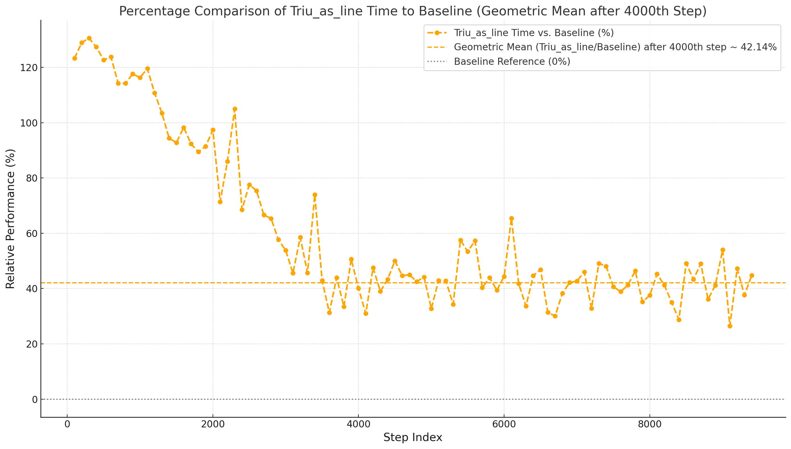
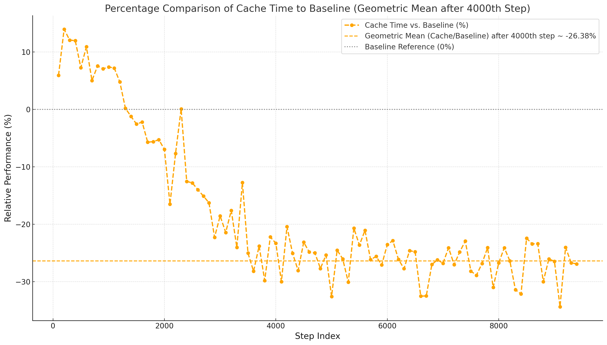
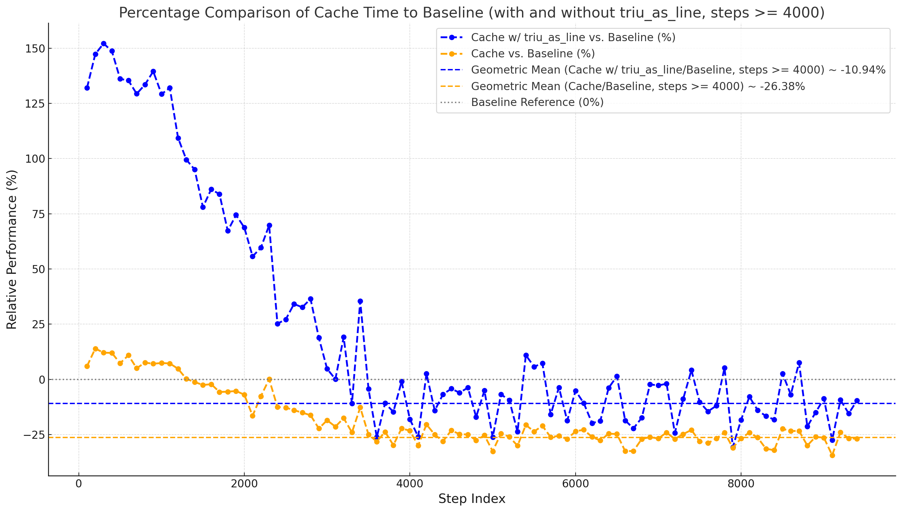

# PSGD Efficiency

This document discusses various methods of reducing PSGD's memory and compute overhead, as well as the trade-offs
involved.

## `triu_as_line`

`triu_as_line` is an argument that reduces the preconditioniner (`Q`) storage overhead by storing only the upper
triangle of the triangular `Q` as a 1D array, halving memory usage.\
This comes at the cost of having to remap the 1D array to a 2D array every time the preconditioner is used, which needs
significant memory bandwidth.
`triu_as_line` is enabled by default, and can be disabled by setting it to `False`.\

A high-overhead test-case (`python3 xor_digit.py --batch 16 --size 1024 --length 4 --depth 1`) showed that the total
step time may be increased by up ~58% when training with `triu_as_line=True`.\
Larger batch sizes help ammortize this issue.

## Cached Preconditioner

For `PSGDKron`, there's an alternative variant, `CachedPSGDKron`.\
PSGDKron computes the preconditioning matrix on the fly based on the triangular `Q`. However, this preconditioner can be
precomputed and reused across steps. This reduces the per-step overhead of computing the preconditioner, but doubles
the memory overhead.

If the doubled memory cost of `CachedPSGDKron` is too high, it's possible to use `CachedPSGDKron` with
`triu_as_line=True`, which reduces the total memory cost from 2x `Q` to 1.5x `Q`.

